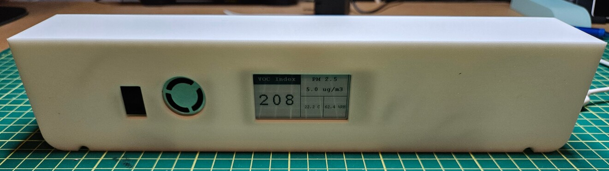
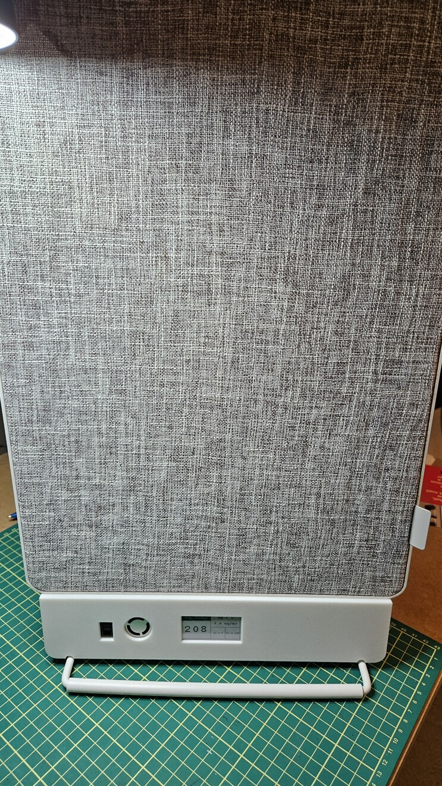
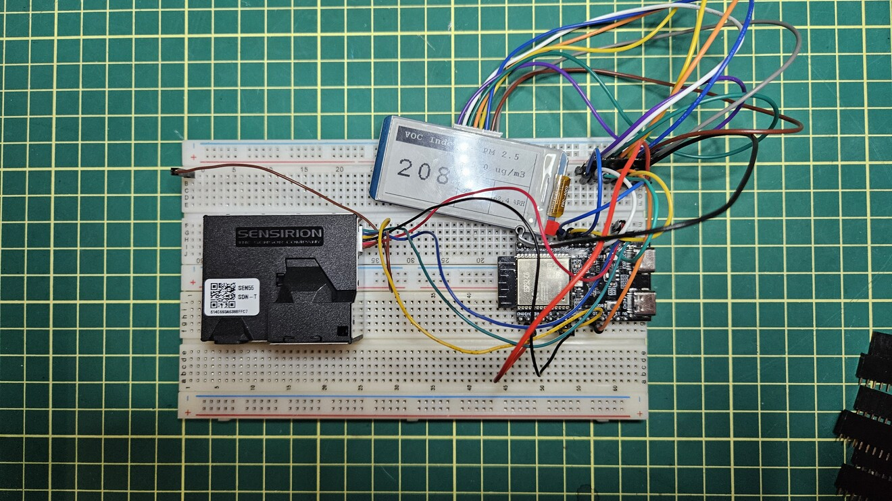
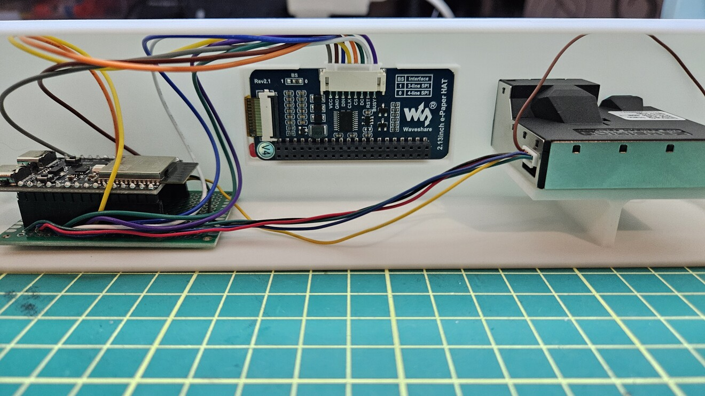
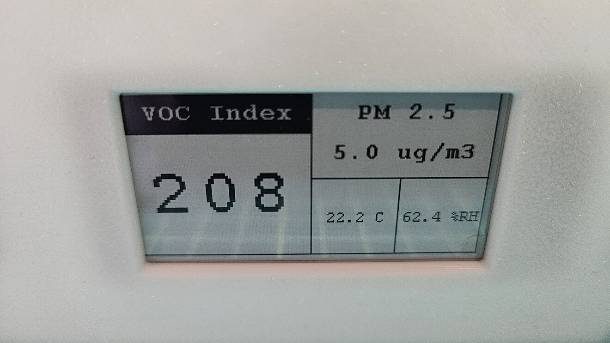

# ESP32-C6 Zigbee Air Quality Monitor

**Disclosure:** *Much of the source code for this project was developed with the aid of Claude Code.*

An ESP32-C6 that joins an existing Zigbee coordinator (Zigbee2MQTT, ZHA, deCONZ,
a Hue/SmartThings hub, ...) as a **Router** and exposes:

- an **On/Off Light** driving the onboard LED on GPIO 8, controllable from the
  coordinator;
- all eight **Sensirion SEN55** channels — PM1.0, PM2.5, PM4.0, PM10, temperature,
  relative humidity, VOC index and NOx index;
- a local readout on a **Waveshare 2.13" e-Paper HAT (V4)**, showing the VOC index
  large alongside PM2.5, temperature and humidity.

Built with ESP-IDF 5.5 under PlatformIO.

[`docs/architecture.md`](docs/architecture.md) has Mermaid diagrams of the
components, tasks, commissioning state machine and the two runtime paths.



The enclosure was specifically designed to be paired with an [IKEA Fornugtig](https://www.ikea.com/ca/en/p/foernuftig-air-purifier-white-50461961/) air filter. Filter has an optional carbon filter for VOCs which is a decent size.



## Build and flash

```sh
pio run -t upload -t monitor
```

To get the device onto your network, put the coordinator into "permit join" mode
and reset or power-cycle the board. On success the log shows:

```
joined as Router: ext PAN .., PAN 0x1a62, channel 15, short addr 0x1234
```

Credentials persist in the `zb_storage` partition, so later reboots rejoin
silently. If the coordinator removes the device it clears the LED and starts
searching again.

## Hardware

| Part | Notes |
|---|---|
| [ESP32 C6](https://docs.espressif.com/projects/esp-dev-kits/en/latest/esp32c6/esp32-c6-devkitc-1/user_guide.html) | C6 variety needed for Zigbee stack support; flash use is only about 700KB |
| [Sensiron SEN55](https://sensirion.com/products/catalog/SEN55) | Air sensor for particulate count, NOx, VOCs, temperature and relative humidity |
| [Waveshare 2.13" e-Paper Display](https://www.waveshare.com/wiki/2.13inch_e-Paper_HAT) | 250x122 black and white e-paper display | 






### LED

GPIO 8 on the ESP32-C6-DevKitC-1 is the **onboard addressable WS2812**, not a
plain LED — a GPIO level will not light it, so it is driven as a one-pixel strip
over RMT via the `led_strip` component. See [`src/led.c`](src/led.c).

### SEN55

Wired to I2C on **SDA = GPIO 6, SCL = GPIO 7**. Override with
`SEN5X_I2C_SDA_GPIO` / `SEN5X_I2C_SCL_GPIO` in
[`components/sen5x/sensirion_i2c_hal.c`](components/sen5x/sensirion_i2c_hal.c).

Per the Sensirion pinout:

| Name | GPIO | Notes | Wire color |
|-----|------|-------|---|
| VCC | 5V | **5 V** ±10% (the fan needs it) | green |
| GND | GND | | red |
| SDA | 6 | 3.3 V logic is fine | yellow |
| SCL | 7 | 3.3 V logic is fine | black |
| SEL | GND | **Must be tied to GND**, or the sensor will not speak I2C | blue |
| NC | none | Do not connect | brown | 

The internal pull-ups are enabled as a fallback, but they are ~45 kΩ — fit
external 10 kΩ pull-ups to 3V3 for anything longer than a stub harness.

### e-Paper display

Waveshare 2.13" e-Paper HAT **V4** — 250x122, black/white, SSD1680.

| Signal | GPIO | Notes | Wire color |
|---|---|---|---|
| DIN (MOSI) | 23 | | blue |
| CLK (SCK) | 22 | | yellow |
| CS | 10 | | orange |
| DC | 19 | | green |
| RST | 20 | | white |
| BUSY | 21 | HIGH = busy | purple |
| VCC | 3V3 | | gray |
| GND | GND | | brown | 

**Not GPIO 6 and 7**, which the Waveshare wiring guide suggests and which are
also SPI2's IOMUX pins — those are the SEN55's I2C bus. The display runs through
the GPIO matrix instead, which is fine at the 2 MHz this panel is clocked at.
Pins are overridable at the top of
[`components/epaper/DEV_Config.h`](components/epaper/DEV_Config.h).

Screen layout, 250x122:

```
0            125                 187    250
+-------------+---------------------------+ 0
| VOC Index   |          PM 2.5           |     <- black text on white
+----------28-+                           |
|             |        8.1 ug/m3          |
|             +-------------+-------------+ 60
|     137     |   21.9 C    |  61.0 %RH   |
+-------------+-------------+-------------+ 122
```



[`tools/epd-preview/`](tools/epd-preview) renders this layout on your machine —
it compiles the real `src/display_layout.c` against the same fonts, so you can
check a layout change without flashing. `make preview` from that directory.

The VOC index is Font24 pixel-doubled to 34x48 -- Waveshare ship nothing larger
than 24 px, which is under 5 mm on this panel. Labels are Font16, the bottom row
Font12. Values that would outgrow their cell drop a decimal rather than run into
the frame (PM2.5 at three digits, humidity at 100 %RH). During VOC warm-up the
headline shows `--`.

**Careful with the reference code.** The ESP32 example in Waveshare's repo under
`E-paper_Separate_Program/2in13_e-Paper_G/` is for the four-colour 2.13" **G**
panel — different controller, 2 bits per pixel, no partial refresh. It will not
drive a V4, and the repo has no ESP32 example for V4 at all. The driver here is
the plain-C one from `RaspberryPi_JetsonNano/c/lib/`, with a locally written
ESP-IDF HAL.

### Board configuration

The PlatformIO board manifest for `esp32-c6-devkitc-1` assumes 8 MB of flash;
this board has **16 MB**, so `platformio.ini` and `sdkconfig.defaults` override
it. [`partitions.csv`](partitions.csv) is custom because the Zigbee stack
requires `zb_storage` and `zb_fct` partitions — without them `esp_zb_start()`
aborts at boot.

## Zigbee endpoint map

| Endpoint | Cluster(s) | Exposes |
|----------|------------|---------|
| 10 | On/Off (+ Basic, Identify, Groups, Scenes) | LED |
| 11 | Temperature, Rel. Humidity, PM2.5 Measurement | T, RH, PM2.5 |
| 12 | Analog Input | VOC index |
| 13 | Analog Input | NOx index |
| 14 | Analog Input | PM1.0 |
| 15 | Analog Input | PM4.0 |
| 16 | Analog Input | PM10 |

Endpoint 11 uses standard ZCL measurement clusters, so coordinators discover
those three channels without a custom converter. The remaining five channels
have no standard cluster and are exposed as Analog Input, which can only appear
once per endpoint — hence one endpoint each, labelled through the cluster's
Description attribute.

The sensor is sampled every 10 s. Reporting is min 10 s / max 300 s with
per-channel deltas (0.5 °C, 1 %RH, 1 µg/m³, 5 index points), installed on the
device so it reports even if the coordinator never sends Configure Reporting.

## Zigbee2MQTT

**The external converter is not optional.** Without it Z2M falls back to an
auto-generated definition that publishes endpoint-suffixed keys
(`temperature_11`, `state_10`), ignores the five Analog Input channels, and — the
part that actually hurts — never binds the measurement clusters, so the device
has nowhere to send reports and every value stays `null`.

Drop [`zigbee2mqtt/esp32c6_airquality.mjs`](zigbee2mqtt/esp32c6_airquality.mjs)
into the `external_converters/` folder beside `configuration.yaml`, restart Z2M,
then hit **Reconfigure** on the device so the converter's `configure()` runs the
binds and Configure Reporting.

Files in that folder are auto-loaded; Z2M 2.x removed the `external_converters:`
configuration key. On 2.11.0 and later, also set `enable_external_js: true`.

The converter's endpoint→property map has to stay in step with the endpoint
macros in [`src/zb_sensor.h`](src/zb_sensor.h).

### MQTT

Note: the topic is derived from the friendly name given to the device.
```
z2m:mqtt: MQTT publish: topic 'zigbee2mqtt/ZB_SEN55', payload '{"humidity":60.99,"linkquality":98,"nox_index":1,"pm1":7.6,"pm10":8.1,"pm25":8,"pm4":8.2,"state":"OFF","temperature":21.85,"voc_index":137}'
```

## Design notes

**On/Off, Off and Toggle all arrive as a write of the `OnOff` attribute**, so a
single attribute handler covers all three. The stack has already updated the
attribute store by the time the handler runs; its only job is to make the
hardware match.

**PM2.5 units.** The ZCL concentration clusters nominally carry a *fraction of
one*, but real PM2.5 devices — and Zigbee2MQTT's converter — treat the value as
µg/m³. This firmware sends µg/m³.

**VOC and NOx during warm-up.** Both algorithms need roughly a minute before
they produce anything, which the driver signals with an "unknown" sentinel.
Those attributes are left untouched rather than written as zero, so the
coordinator keeps showing the last good index instead of a false reading.

**`manuf_code` must be `0xFFFF` in reporting info.** It is part of the key the
stack uses to find the attribute, and the "not manufacturer specific" value is
`ESP_ZB_ZCL_ATTR_NON_MANUFACTURER_SPECIFIC` (0xFFFF), *not* 0. Leaving the field
zeroed makes `esp_zb_zcl_update_reporting_info()` fail with `ESP_ERR_NOT_FOUND`
on every attribute, even though `esp_zb_zcl_get_attribute()` finds them all —
attribute writes then land in the store but nothing is ever transmitted.

**Reporting is configured from the network-up signals**, not straight after
`esp_zb_start()`, and retried until it succeeds. `zb_sensor_selftest()` logs
whether each published attribute exists and is reportable; that plus the
reporting warnings is usually enough to tell a firmware fault from a
coordinator-side one.

**Optional Analog Input attributes** (Description, Min/MaxPresentValue) are
added non-fatally. `esp_zb_*_cluster_add_attr()` returns an error for anything
the stack does not implement, and under `ESP_ERROR_CHECK` that would abort the
boot — losing a label is not worth that.

**String attributes use static buffers.** ZCL character strings are
length-prefixed rather than NUL-terminated, and the stack may keep the pointer
it is handed instead of copying the bytes, so the buffers must outlive the call
that registers them.

**Why the display never uses partial refresh.** Partial refresh is much gentler
per update, but it needs the previous image still held in panel RAM, which means
leaving the panel powered between updates — and Waveshare state that a panel held
in a powered high-voltage state is *"damaged beyond repair"*. At a once-a-minute
cadence you cannot have both, so every update is a fast full refresh (~1 s, one
flicker) and the panel sleeps in between. A side benefit is that full refreshes
accumulate no ghosting, so there is no "full refresh every N partials"
bookkeeping and no risk of getting that wrong. The panel must be re-initialised
on every wake; data sent while it is asleep is discarded.

**The display deadband compares rendered strings, not floats.** `screen_t` holds
the formatted text for every field, and a refresh is skipped when the new struct
matches the last one drawn. That answers "would the pixels actually change"
exactly, rather than approximating it with per-channel float thresholds. In still
air the panel therefore refreshes far less often than once a minute — the request
was a *limit*, not a target. A refresh is forced every 24 h regardless, per
Waveshare's image-sticking guidance.

**Three tasks.** The ZBOSS main loop never returns and I2C blocks, so the sensor
runs on its own task and takes the Zigbee lock before touching the attribute
store. The e-Paper gets a third task for the same reason — a refresh blocks for
about a second — at a priority below both, so it can never delay sampling or the
radio. Readings reach it through a one-deep `xQueueOverwrite` mailbox, so the
sensor task never waits on the panel. If the SEN55 or the display does not
respond at startup, that task logs and exits and everything else keeps working.

## Layout

```
src/
  main.c        app entry, commissioning, endpoint assembly, sensor task
  led.c/.h      WS2812 on GPIO 8
  sensor.c/.h   SEN55 lifecycle and sampling, fixed-point -> floats
  zb_sensor.c/.h  sensor endpoints, reporting config, attribute publishing
  display.c/.h  e-Paper task, refresh policy, panel wake/sleep
  display_layout.c/.h  pure drawing -- no ESP-IDF, so it builds on a host too
components/epaper/
  Waveshare 2.13" V4 driver, vendored from
  https://github.com/waveshareteam/e-Paper (RaspberryPi_JetsonNano/c/lib/).
  DEV_Config.c/.h and Debug.h are local -- upstream only ships a Raspberry Pi
  HAL. Three small patches to vendored files are each marked "LOCAL PATCH".
components/sen5x/
  Sensirion SEN5x driver, vendored from
  https://github.com/Sensirion/embedded-i2c-sen5x (BSD-3-Clause, see LICENSE).
  Everything is upstream except sensirion_i2c_hal.c, which is an ESP-IDF port:
  the repo's esp32 sample HAL targets esp-idf-lib's i2c_dev_t rather than plain
  IDF, so this one uses the IDF 5.x i2c_master driver directly.
```

tools/epd-preview/
  Host-side renderer for the screen layout, see its README.

`esp-zigbee-lib`, `esp-zboss-lib` and `led_strip` are pulled from the Espressif
component registry via [`src/idf_component.yml`](src/idf_component.yml).

## Troubleshooting

**`ModuleNotFoundError: No module named 'intelhex'` when generating
`bootloader.bin`** — PlatformIO's bundled esptool needs it and its virtualenv
may not have it:

```sh
~/.platformio/penv/bin/python -m pip install intelhex
```

**Device never joins** — confirm the coordinator is permitting joins. Scanning
all 16 channels takes a while; narrowing `ZB_PRIMARY_CHANNEL_MASK` in
[`src/main.c`](src/main.c) to your coordinator's channel (e.g. `1 << 15`) makes
joining much faster.

**`device reset failed` from the `sen55` tag** — check the 5 V supply, that SEL
is tied to GND, and the pull-ups.

**Blank e-Paper** — BUSY is pulled down, so a disconnected panel looks idle and
fails silently rather than stalling. Check the six signal pins, then drop
`EPD_SPI_HZ` in [`components/epaper/DEV_Config.h`](components/epaper/DEV_Config.h)
to 1 MHz; flying leads are the usual culprit. `e-Paper BUSY stuck high` in the log
(at debug level) means the panel is wired but not responding.
