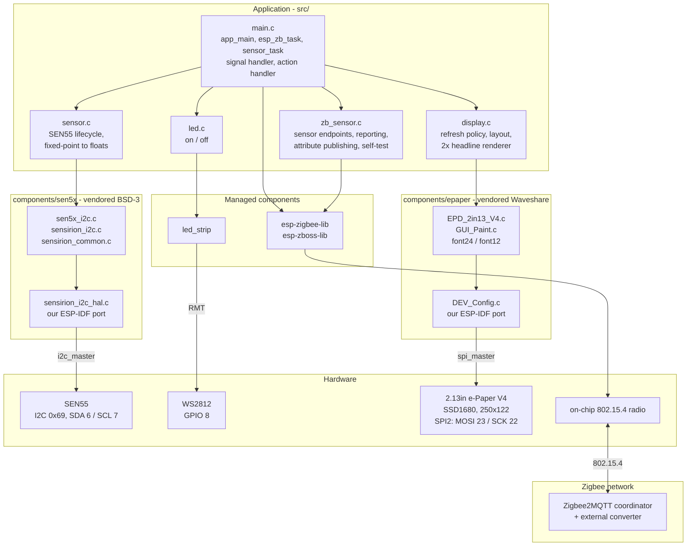
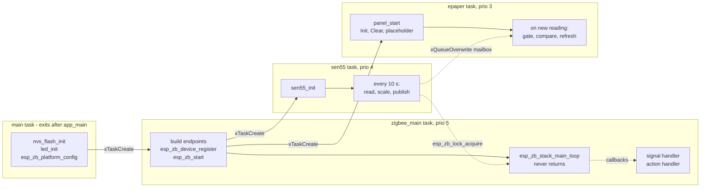
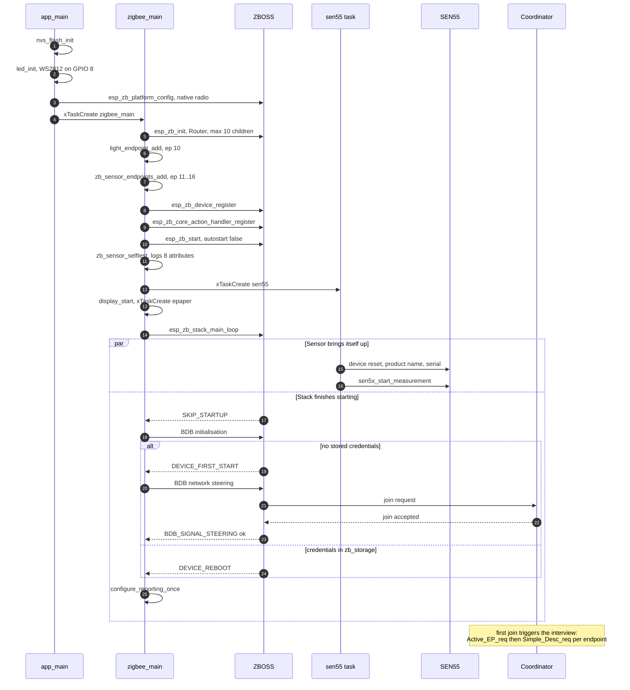
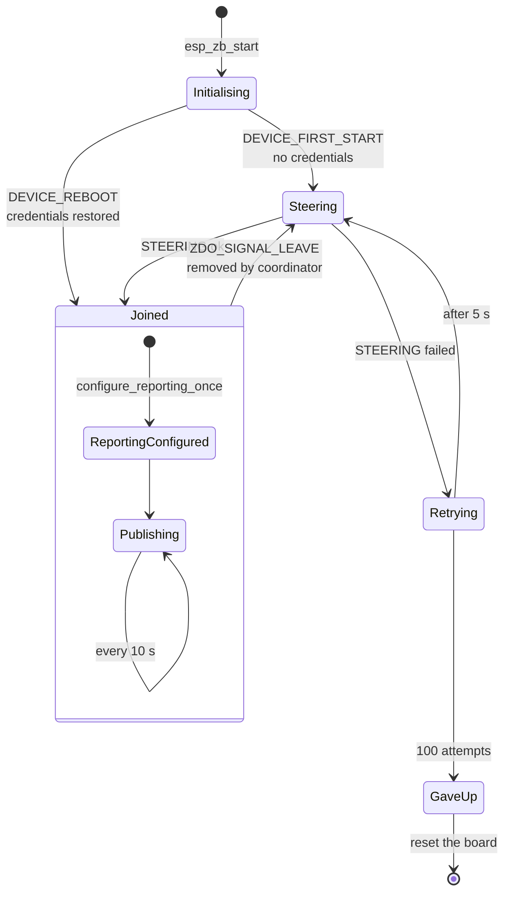
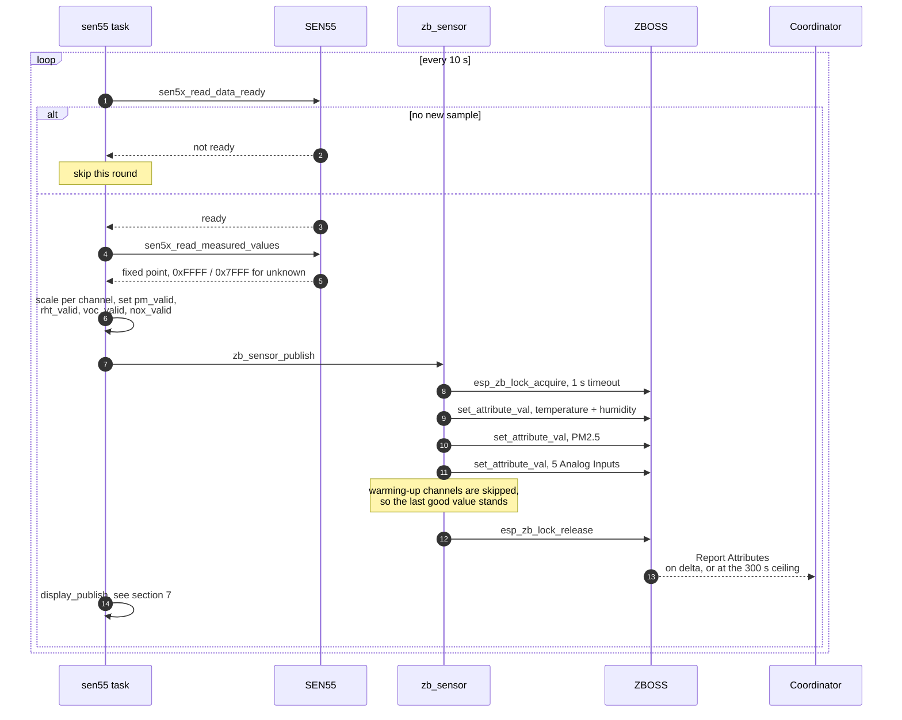
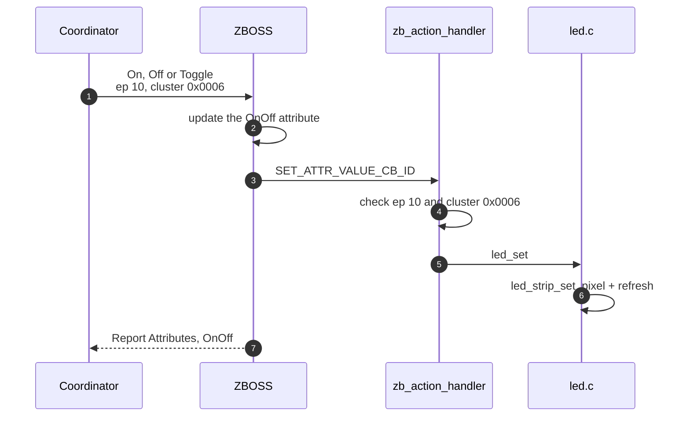
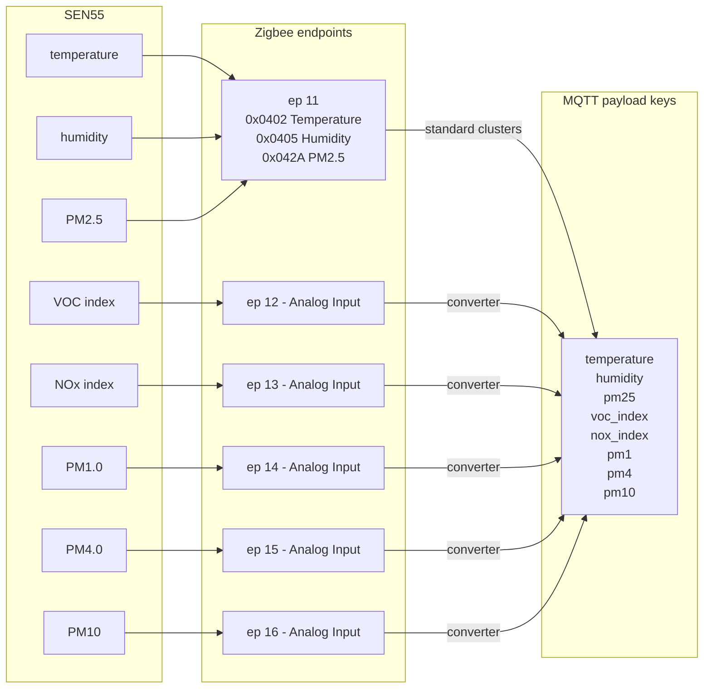

# Architecture

Diagrams are Mermaid, which GitHub and VS Code render inline.

## 1. Components

Who calls whom. The application layer is deliberately thin: `main.c` owns
lifecycle and the Zigbee callbacks, and everything device-specific sits behind a
small module.



## 2. Tasks

Four threads of control. The split exists because the ZBOSS main loop never
returns, and both I2C transfers and e-Paper refreshes block.



The lock matters: `zb_sensor_publish()` runs on the sensor task and touches the
attribute store, which belongs to the stack. Callbacks in `D` are already inside
the stack's context and must **not** take the lock.

The e-Paper sits at the bottom of the priority order because a refresh blocks for
about a second, and it is fed through a one-deep `xQueueOverwrite` mailbox rather
than called directly — so the sensor task never waits on the panel, and a slow
refresh costs at most a dropped intermediate sample, never a delayed one.

## 3. Startup and commissioning



`configure_reporting_once()` is deliberately driven from the network-up signals.
Calling it straight after `esp_zb_start()` fails, because that call only queues
startup — ZBOSS has not built its reporting table yet.

## 4. Commissioning states



## 5. Publishing a sample



Scale factors and sentinels live entirely in `sensor.c`; the Zigbee side only
ever sees floats plus validity flags.

## 6. Turning the LED on and off



All three commands arrive as a write of the same `OnOff` attribute, so one
handler covers them. The stack has already updated the store by then — the
handler only makes the hardware agree.

## 7. Refreshing the display

```mermaid
sequenceDiagram
    autonumber
    participant ST as sen55 task
    participant MB as mailbox
    participant DT as epaper task
    participant P as e-Paper V4

    ST->>MB: display_publish, xQueueOverwrite
    Note over MB: one deep -- a new sample<br/>replaces an unread one

    DT->>MB: xQueueReceive, 1 s timeout
    MB-->>DT: latest reading

    alt less than 60 s since last refresh
        Note over DT: skip, the once-a-minute cap
    else
        DT->>DT: format_screen into screen_t
        alt strings identical to what is drawn
            Note over DT: skip -- the pixels<br/>would not change
        else changed, or 24 h have passed
            DT->>DT: render into the 4000 byte buffer
            DT->>P: Init_Fast
            DT->>P: Display_Fast, ~1 s
            DT->>P: Sleep
            Note over P: asleep until the next update;<br/>re-init required on wake
        end
    end
```

The deadband compares formatted strings rather than floats, so it answers "would
the screen look different" exactly. In still air the panel refreshes far less
often than once a minute.

## 8. Channel to endpoint to MQTT



Endpoint 11's three channels have standard ZCL clusters and would be discovered
generically. The other five are bare Analog Input clusters carrying nothing that
says what they measure — the endpoint number is the only discriminator, which is
why the external converter maps endpoint to property name and why that map has
to track [`src/zb_sensor.h`](../src/zb_sensor.h).
